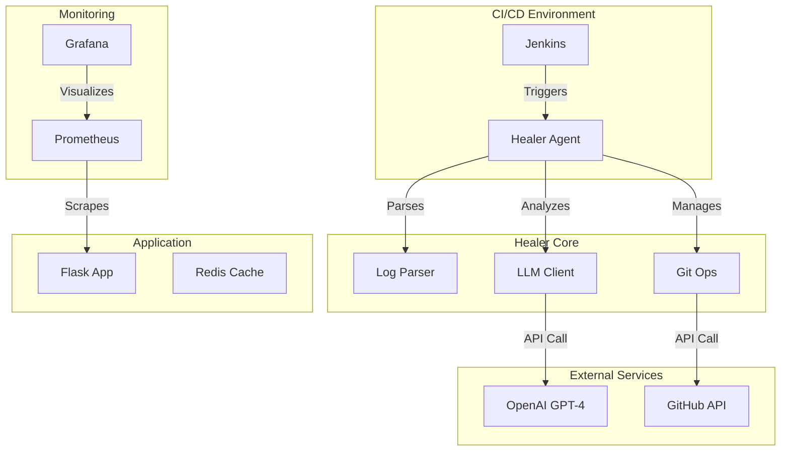

# System Architecture

## Overview

The AI-Driven Self-Healing CI/CD Platform is a microservices-based system designed to automatically detect, analyze, and fix build failures.

## Component Diagram

## Core Components

### 1. Jenkins CI
- Executes the build pipeline
- Detects failures
- Triggers the Healer Agent via post-build actions

### 2. Healer Agent
The central brain of the system.
- **Log Parser**: innovative multi-pattern matching for `pytest`, `unittest` and generic errors.
- **LLM Client**: Interfaces with OpenAI to generate code fixes.
- **Git Ops**: Manages branching, committing, and PR creation.

### 3. Monitoring Stack
- **Prometheus**: Collects metrics from the application and Jenkins.
- **Grafana**: Provides visual dashboards for system health and healing statistics.

## Data Flow

1.  **Failure Detection**: Jenkins build fails -> Log capture.
2.  **Analysis**: Healer Agent parses logs -> Extracts error context.
3.  **Diagnosis**: Error context -> LLM -> Root cause analysis & fix generation.
4.  **Remediation**: Fix -> New Branch -> Commit -> Pull Request.
